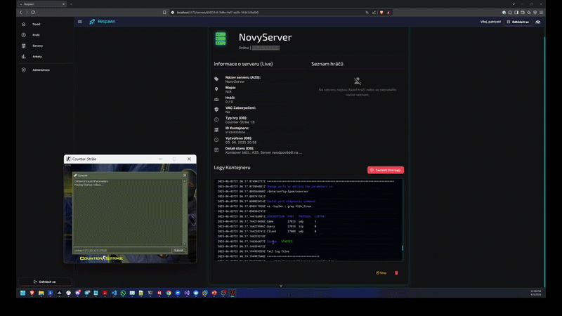
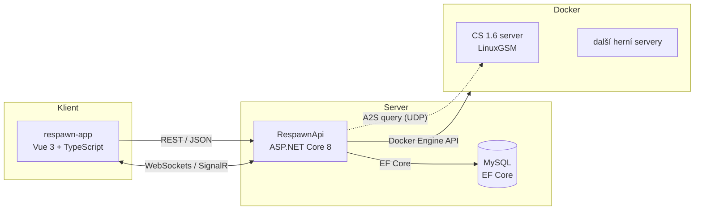

# Respawn — správa herních serverů pro LAN party

Webová aplikace, která na jedno kliknutí vytvoří, spustí a zastaví dedikovaný herní server běžící v Docker kontejneru — a v reálném čase ukazuje jeho stav, mapu i seznam připojených hráčů. Součástí jsou ankety, uživatelské profily a přehled, kdo je právě online.

**Backend:** ASP.NET Core 8 (Web API + SignalR) · EF Core / MySQL · ASP.NET Core Identity + JWT · Docker.DotNet
**Frontend:** Vue 3 · TypeScript ·

> Vzniklo jako semestrální práce na FAV ZČU a dál se na tom pracuje. Motivace byla praktická: na LAN party se herní servery obvykle zakládají ručně. Respawn z toho dělá pár kliknutí v prohlížeči.

 

---

## Co je na tom technicky zajímavé

- **Orchestrace Dockeru přímo z .NET.** `ContainerManagementService` mluví s Docker Engine API přes knihovnu `Docker.DotNet` — vytváří kontejnery z LinuxGSM images, přiděluje porty, spouští, zastavuje a maže je včetně volumes. Žádné volání shellu.
- **Vlastní implementace A2S query protokolu.** Aby aplikace věděla, kdo hraje a na jaké mapě, posílá hernímu serveru UDP dotazy podle Valve A2S protokolu a parsuje binární odpověď (`A2SGoldSourceStrategy` pro GoldSource / CS 1.6). Včetně timeoutů a fallbacku, když server neodpoví.
- **Strategy + Factory pattern pro podporu dalších her.** Každá hra má jiný query protokol; `GameServerInfoStrategyFactory` vybírá podle `GameType` implementaci `IGameServerInfoStrategy`. Přidání nové hry znamená přidat třídu, ne měnit stávající kód.
- **Real-time přes SignalR.** Čtyři huby — stav serverů, streamování konzolových logů z kontejneru, výsledky anket a sledování online uživatelů. JWT se u WebSocket spojení předává query parametrem, protože hlavičky tam nejsou k dispozici.
- **Background service pro monitoring.** `GameServerStatusMonitorService` (`BackgroundService`) každých 15 s porovnává stav v databázi se skutečným stavem kontejnerů a změny rovnou pushuje klientům přes `IHubContext`.
- **Vrstvená architektura.** Controllers → Application (services, DTOs, interfaces) → Domain (entity, enumy) → DataAccess (repositories, EF Core `DbContext`). Závislosti přes DI, repository pattern nad EF Core.

## Funkce

| Oblast | Co umí |
| --- | --- |
| Herní servery | Vytvoření, start, stop, smazání serveru; detail se stavem, počtem hráčů, mapou a pingem; real-time streamování logů z konzole |
| Ankety | Založení ankety, hlasování, průběžné výsledky aktualizované v reálném čase |
| Uživatelé | Registrace, přihlášení, JWT, tři role (Administrátor / Správce / Uživatel), profily |
| Přítomnost | Seznam právě online uživatelů |
| Administrace | Správa rolí a uživatelů, správa Docker images a volumes |

Role se propisují do autorizace API — destruktivní operace jsou omezené atributem `[Authorize(Roles = "Admin")]`.

## Architektura



Kontejnery běží v síťovém režimu `host`, takže herní server naslouchá přímo na IP hostitele — klienti se k němu připojí běžným způsobem ze hry.

## Struktura repozitáře

```
RespawnApi/            # backend (ASP.NET Core 8)
  Controllers/         # vstupní body API
  Application/         # business logika
    Services/          # aplikační služby (Docker, query, monitoring, tokeny)
    Strategies/        # A2SGoldSourceStrategy, NoDetailsStrategy
    Factories/         # GameServerInfoStrategyFactory
    DTOs/ Interfaces/
  Domain/              # entity a enumy (GameServer, Poll, UserProfile, ServerStatus…)
  DataAccess/          # repositories + RespawnDbContext
  Hubs/                # GameServerHub, ServerLogHub, PollHub, PresenceHub
  Migrations/          # EF Core migrace
respawn-app/           # frontend (Vue 3 + Vite)
  src/views/ components/ services/ stores/ router/
docs/                  # technická dokumentace
```

## Rychlý start

**Předpoklady:** .NET 8 SDK · Node.js · Docker Engine · MySQL

```bash
git clone https://github.com/PatrikMrnka/Respawn.git
cd Respawn
```

**Backend**

1. V `RespawnApi/RespawnApi/appsettings.json` uprav connection string a `JwtSettings` (klíč musí mít alespoň 32 bytů; v produkci ho drž v proměnných prostředí, ne v souboru).
2. Aplikuj migrace a spusť API:

```bash
cd RespawnApi/RespawnApi
dotnet ef database update
dotnet run
```

API běží na adrese z `Properties/launchSettings.json` (typicky `https://localhost:5207`), interaktivní dokumentace na `/swagger`. Při startu se seedují role a administrátorský účet.

**Frontend**

```bash
cd respawn-app
npm install
echo "VITE_API_BASE_URL=http://localhost:5207" > .env
npm run dev
```

Aplikace naběhne na `http://localhost:5173`.

> Herní servery potřebují stažené LinuxGSM Docker images (např. `gameservermanagers/gameserver:cs`) a volné porty na hostiteli (CS 1.6 používá `27015/udp`).

## API

RESTful, dokumentované přes Swagger/OpenAPI (Swashbuckle) na endpointu `/swagger`. Autentizace se posílá jako `Authorization: Bearer <token>`, u SignalR spojení jako query parametr `access_token`.

## Stav projektu a další kroky

Hotovo: správa uživatelů a rolí, celý životní cyklus herních serverů, ankety, profily, přítomnost, real-time logy, administrace Docker images a volumes.

V plánu: konfigurace serveru z UI (změna mapy, slotů, RCON přes příkazy LinuxGSM), statistiky hráčů a žebříčky, `docker-compose.yml` pro nasazení celé sestavy jedním příkazem, podpora dalších query protokolů (Source, Minecraft).

## Dokumentace

Podrobná technická dokumentace — požadavky, architektura, návrhové vzory, diagramy tříd, případů užití, sekvenční a nasazení — je v [`docs/dokumentace.pdf`](docs/dokumentace.pdf).

## Autor

Patrik Mrnka — [github.com/PatrikMrnka](https://github.com/PatrikMrnka) · [linkedin.com/in/patrik-mrnka](https://www.linkedin.com/in/patrik-mrnka/)